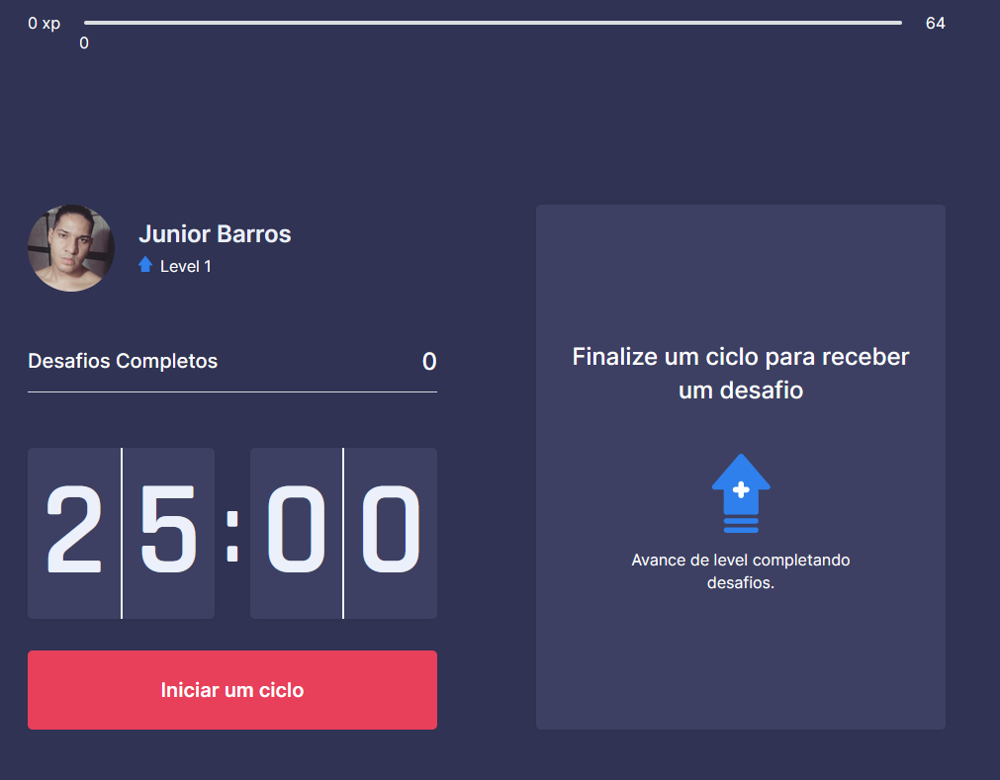

# Recon-Training

<h2>Welcome to Recon Training (moveIt) </h2>
<p>This aplication use React.js, Next and PWA support. Based on NextLevelWeek#4 from rocketseat workshop.</p>



## Getting Started

First, install dependencies:

```bash
npm install
```
and, run the development server:

```bash
npm run dev
```

Open [http://localhost:3000](http://localhost:3000) with your browser to see the result.

This aplication support pwa, verify in your smartphone. 

Technologies used 

<ul>
  <li>React</li>
  <li>NEXT</li>
</ul>


<strong> Hi! i'm Sylvn001 -- Visit my social medias. i created many projects in my GitHub!! </strong>

<h3> Follow me! </h3>
Instagram: https://www.instagram.com/s1lvn/ <br> 
Twitch: https://www.twitch.tv/sylvn001 <br>
GitHub: https://github.com/Sylvn001 <br>

